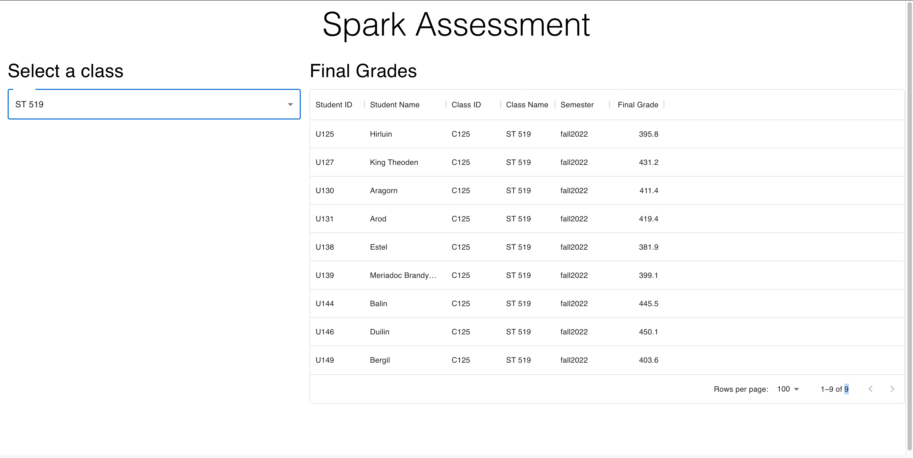

### Project Goal

The goal is to build a portal that displays the final grades for all students in a particular class from a given semester. All the information required can be retrieved from the API. You will need to make multiple queries to retrieve all the required information. You will also need to compute the final grade using the combination of assignment grade and assignment weight (provided by the API).

The final grade may not be within the 0-100 range as the data was randomly generated. To calculate the final grade, the following general formula can be used: $grade_{final} = \sum(grade_i*weight_i)$

The website should look like this image:

### Required Software

To get started with this project you will need the following setup on your computer:

- Node.js Version 19 or greater
- VS Code or your favorite editor that supports Typescript (we really recommend VS Code though)
- Git Version Control

### `App.tsx`

This is the "home" of the app and is where everything starts from. 

### `/components/GradeTable.tsx`

This file contains a stub function for you to fill in with the code required to present the grade table. 

### `/types/api_types.ts`

This file is where you can store interfaces and types for data you receive from the API. 

### `/utils/calculate_grade.ts`

This file stores some stub functions to help you get started on the process of calculating all the final grades. 

### `globals.ts`

This file stores some global variables. 

## Project Resources:

### API

The API can be found here: https://spark-se-assessment-api.azurewebsites.net/api

You can explore the API routes using the Swagger UI (it might take ~15s to load): https://spark-se-assessment.azurewebsites.net/api/ui

